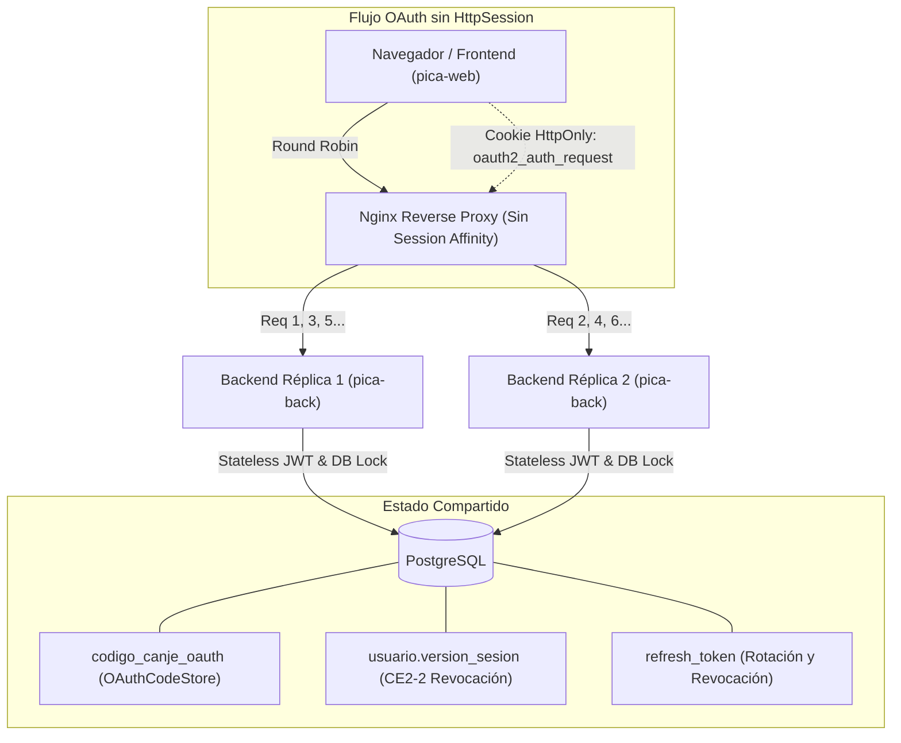

# Escalado horizontal y session affinity

> **Espacio Confluence:** Plataforma PICA / Arquitectura y Despliegue  
> **Jira:** [PICA-153](https://laumolina.atlassian.net/browse/PICA-153) (CE2-9)  
> **Autor:** Equipo Backend PICA (Hydra)  
> **Estado:** Implementado / Aprobado  

---

## 1. Contexto y Devolución de Arquitectura

En la revisión técnica de la plataforma recibimos la siguiente devolución:

> *"Recomendación: tener presente el escalado horizontal (réplicas del servidor de backend). Investigar: Session affinity."*

Nuestra arquitectura base ya fue concebida como **Stateless** (autenticación mediante tokens JWT firmados con RS256 y persistencia relacional en PostgreSQL). Al evaluar el escalado horizontal con dos o más réplicas de `pica-back` detrás de un balanceador de carga, se analizó si convenía activar **Session Affinity (Sticky Sessions)** o resolver los puntos de acoplamiento en memoria para permitir un balanceo de carga puro (Round Robin).

La decisión de diseño adoptada fue **rechazar Session Affinity** y garantizar que la API sea 100% independiente del nodo que atienda cada solicitud.

---

## 2. ¿Por qué NO usamos Session Affinity?

Session Affinity obliga al balanceador de carga a dirigir todas las solicitudes de un mismo usuario o navegador a la misma réplica del backend que atendió la primera petición (usualmente mediante cookies de afinidad o hashing de IP de origen).

Descartamos esta técnica por dos desventajas fundamentales:

### A. Reparto desparejo de la carga (Load Imbalance)
* **Desbalance de tráfico:** Si un subconjunto de usuarios genera un uso intensivo (múltiples subidas de datos, consultas recurrentes o sesiones prolongadas), la réplica asignada sufre una degradación severa de CPU y memoria mientras las réplicas restantes quedan ociosas.
* **Incompatibilidad con elasticidad (Auto-scaling):** Al agregar nuevas réplicas durante picos de demanda, los usuarios ya conectados no son redistribuidos hacia las nuevas instancias, impidiendo aliviar la carga de forma inmediata y uniforme.

### B. Pérdida de estado ante caída o reinicio de réplica (Resilience & Failover)
* **Punto único de falla por sesión:** Si una réplica se cae, se reinicia por mantenimiento o es destruida durante una reducción de escala (*scale-in*), todo el estado en memoria que dependía de la afinidad se pierde definitivamente.
* **Experiencia de usuario rota:** En logins federados (Google OAuth2), si la réplica que inició la redirección se reinicia o el callback de Google es desviado a otra réplica, el login falla con errores de `state` no encontrado o código inválido, forzando al usuario a reiniciar el proceso.

### C. Complejidad y acoplamiento en infraestructura
* Requiere que balanceadores (Nginx, AWS ALB, Cloudflare) inspeccionen tráfico HTTP de capa 7 para gestionar cookies propietarias de afinidad.
* Complica despliegues sin interrupción (*Zero Downtime Deployments* como Blue/Green o Canary) porque obliga a implementar largos tiempos de *connection draining* esperando que las sesiones activas expiren.

---

## 3. Diagnóstico Inicial: Puntos que se rompían con múltiples réplicas

Al auditar la API con dos réplicas en Round Robin puro, identificamos tres componentes específicos que almacenaban estado efímero en la memoria de la JVM:

1. **`OAuthCodeStore` en memoria (`ConcurrentHashMap`):**
   * *Problema:* El flujo de Google OAuth redirige al front con un `code` temporal de un solo uso. `OAuthCodeStore` guardaba el código en un mapa en memoria en la réplica A. Cuando el frontend llamaba a `POST /api/v1/auth/exchange`, si la petición caía en la réplica B, devolvía `400 CODIGO_INVALIDO`.
2. **State de Google OAuth en `HttpSession`:**
   * *Problema:* Spring Security por defecto almacena el objeto `OAuth2AuthorizationRequest` (que incluye el parámetro criptográfico `state`) en la sesión HTTP en memoria del servlet. Si el callback `GET /login/oauth2/code/google` caía en otra réplica, la sesión no existía y el login fallaba con error de autenticación.
3. **Generación efímera de claves RSA en `JwtKeyProvider`:**
   * *Problema:* Si no se configuraban `JWT_PRIVATE_KEY` y `JWT_PUBLIC_KEY`, cada réplica generaba su propio par de claves RSA al arrancar. Un access token emitido por la réplica A fallaba con firma inválida al ser verificado por la réplica B.
4. **Revocación de sesiones y tokens (CE2-2):**
   * *Problema:* La revocación inmediata de access tokens y refresh tokens ante cierres de sesión, cambio de roles o detección de reutilización debe reflejarse en todas las réplicas sin depender de memoria compartida o afinidad.

---

## 4. Qué cambiamos para no necesitar Session Affinity

Para resolver estos cuatro puntos y lograr un escalado horizontal transparente, implementamos las siguientes soluciones:



### 1. Persistencia de códigos OAuth en PostgreSQL
* **Migración `V7__codigo_canje_oauth.sql`:** Se creó la tabla `codigo_canje_oauth` con `codigo_hash VARCHAR(64) UNIQUE`, `usuario_id BIGINT`, `vence_en TIMESTAMPTZ` y `usado BOOLEAN`.
* **Seguridad:** El código en texto plano (UUID) nunca se guarda en la base; se almacena exclusivamente su hash SHA-256.
* **Concurrencia:** La consulta en `CodigoCanjeOAuthRepository` utiliza `@Lock(LockModeType.PESSIMISTIC_WRITE)` para bloquear la fila durante el canje, garantizando que intentos concurrentes entre réplicas no puedan reutilizar el código.
* **Resultado:** La réplica A genera el código tras el callback de Google; la réplica B lo canjea sin ningún inconveniente en `POST /api/v1/auth/exchange`.

### 2. Authorization Request Repository en Cookie y sesión STATELESS
* **Clase `HttpCookieOAuth2AuthorizationRequestRepository`:**
  * Implementa `AuthorizationRequestRepository<OAuth2AuthorizationRequest>` de Spring Security.
  * Al iniciar el login (`/oauth2/authorization/google`), el `OAuth2AuthorizationRequest` (con su `state` CSRF) se serializa y se envía al navegador en una cookie segura:
    * `Name`: `oauth2_auth_request`
    * `HttpOnly`: `true` (inaccesible desde JavaScript)
    * `SameSite`: `Lax` (se envía en la navegación de retorno desde Google)
    * `Max-Age`: 180 segundos (TTL corto)
    * `Path`: `/`
* **Sesión `STATELESS` en `SecurityConfig`:**
  * Se configuró `http.sessionManagement(sm -> sm.sessionCreationPolicy(SessionCreationPolicy.STATELESS))`.
  * La JVM del backend no crea ni mantiene ninguna `HttpSession`. Cualquier réplica que reciba la redirección de Google toma la cookie, verifica el `state` criptográfico y completa el flujo.

### 3. Exigencia de claves RSA uniformes en `JwtKeyProvider`
* `JwtKeyProvider` resuelve `JWT_PRIVATE_KEY` y `JWT_PUBLIC_KEY` desde el entorno.
* **Fuera de `dev`, el backend no arranca** si falta cualquiera de las dos claves, arrojando una `IllegalStateException` explícita en el arranque.
* Todas las réplicas en staging o producción comparten el mismo par de claves RSA (RS256) inyectadas por variables de entorno seguras, permitiendo que cualquier réplica valide tokens emitidos por otra.

### 4. Revocación de sesiones en tiempo real en la Base (CE2-2)
* Tanto los refresh tokens (`refresh_token.revocado_en`) como la versión de sesión de los access tokens (`usuario.version_sesion`) residen en PostgreSQL.
* `JwtAuthenticationFilter` consulta la versión de sesión vigente contra la base en cada petición protegida.
* Cuando un usuario cierra sesión, cambia su contraseña o se le modifican los roles, `usuarioRepository.incrementarVersionSesion(usuarioId)` sube el contador en Postgres. En la siguiente petición, sin importar a qué réplica caiga, el access token es rechazado con `401 SESION_REVOCADA`.

---

## 5. Demostración Local con Docker Compose

Para validar el comportamiento en un entorno idéntico a producción, se crearon los siguientes archivos:

1. **`infra/nginx-round-robin.conf`:**
   ```nginx
   upstream backend_cluster {
       server api1:8080;
       server api2:8080;
   }
   server {
       listen 80;
       location / {
           proxy_pass http://backend_cluster;
           proxy_set_header Host $host;
           proxy_set_header X-Forwarded-For $proxy_add_x_forwarded_for;
           proxy_set_header X-Forwarded-Proto $scheme;
           add_header X-Handled-By $upstream_addr always;
       }
   }
   ```
   *(Nginx distribuye peticiones en Round Robin 1:1 e inyecta el header `X-Handled-By` indicando la IP de la réplica que atendió).*

2. **`docker-compose.replicas.yml`:**
   * Servicio `db`: PostgreSQL 16 con healthcheck.
   * Servicio `api1`: Réplica 1 de `pica-back` (puerto 8080 interno).
   * Servicio `api2`: Réplica 2 de `pica-back` (puerto 8080 interno).
   * Servicio `nginx`: Proxy inverso exponiendo el puerto `8080` hacia el exterior.
   * Archivo de variables: `.env.replicas` con claves RSA y configuración compartida.

3. **Script de prueba automatizado (`scripts/probar-replicas.sh`):**
   * Ejecuta peticiones secuenciales verificando la alternancia entre réplicas:
     1. Verificación de balanceo en `/actuator/health` (inspección de `X-Handled-By`).
     2. Login local (`POST /api/v1/auth/login`).
     3. Consumo de endpoint protegido (`GET /api/v1/me`) atendido por la otra réplica.
     4. Rotación de refresh token (`POST /api/v1/auth/refresh`) atendida por réplica alternada.
     5. Inicio de OAuth con verificación de cookie `oauth2_auth_request` y prueba de canje.
     6. Revocación de sesiones (`PUT /api/v1/me/password`) con verificación de rechazo inmediato `401 SESION_REVOCADA` en la otra réplica.

### Cómo ejecutar la prueba

```bash
# 1. Copiar variables de réplicas con claves RSA compartidas
cp .env.replicas.example .env.replicas

# Generar el par de claves RSA que comparten las dos réplicas (en una sola línea cada una)
openssl genpkey -algorithm RSA -pkeyopt rsa_keygen_bits:2048 -out jwt.pem
sed -i "s|^JWT_PRIVATE_KEY=.*|JWT_PRIVATE_KEY=$(tr -d '\n' < jwt.pem)|" .env.replicas
sed -i "s|^JWT_PUBLIC_KEY=.*|JWT_PUBLIC_KEY=$(openssl pkey -in jwt.pem -pubout | tr -d '\n')|" .env.replicas
rm jwt.pem

# 2. Levantar el stack completo (2 réplicas + postgres + nginx)
docker compose -f docker-compose.replicas.yml up --build -d

# 3. Ejecutar la suite de validación de réplicas
./scripts/probar-replicas.sh

# 4. Detener el stack al finalizar
docker compose -f docker-compose.replicas.yml down -v
```

---

## 6. Conclusión y Criterios de Aceptación Cumplidos

| Flujo | Comportamiento sin Session Affinity | Estado |
|---|---|:---:|
| **Login Local** | La petición de login emite tokens con la clave compartida y guarda el refresh hash en Postgres. | **Cumplido** |
| **Login con Google** | El state viaja en la cookie del navegador; el código de canje viaja hasheado a Postgres. Cualquier réplica procesa el inicio, callback y canje. | **Cumplido** |
| **Refresh de Token** | La rotación y detección de reutilización operan contra Postgres con bloqueo pesimista. | **Cumplido** |
| **Revocación (CE2-2)** | La invalidación de sesiones incrementa `version_sesion` en Postgres y se propaga en tiempo real a todas las réplicas. | **Cumplido** |

Gracias a estos cambios, la API de PICA es **completamente stateless**, permitiendo escalar horizontalmente a $N$ réplicas detrás de cualquier balanceador estándar sin requerir afinidad de sesión, logrando máxima resiliencia, alta disponibilidad y distribución de carga uniforme.
